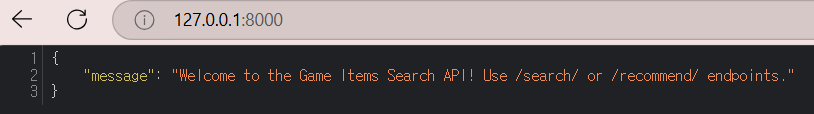
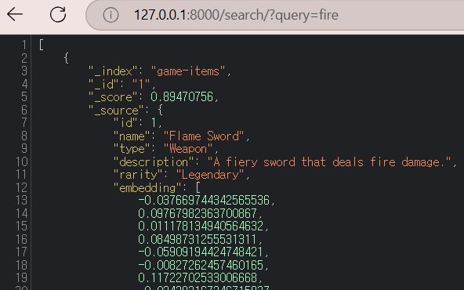
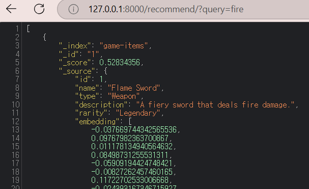

# Game Items Search and Recommendation API

### 프로젝트 소개
OpenSearch와 Sentence Transformers를 활용하여 게임 아이템 데이터를 인덱싱하고, 키워드 검색 및 벡터 기반 추천 기능을 제공하는 REST API를 구축하는 프로젝트.

------------------------------------------
### 주요 기능
- OpenSearch에 게임 아이템 데이터를 저장 및 인덱싱.
- 키워드 기반 검색 및 벡터 임베딩 기반 유사 아이템 추천 기능 제공.
- FastAPI를 활용한 REST API 구현.

### 핵심 기술
- OpenSearch: 대규모 검색 엔진 및 KNN 벡터 검색
- Python: 데이터 처리 및 OpenSearch 연동
- Sentence Transformers: AI 기반 텍스트 임베딩 생성
- FastAPI: REST API 개발 및 서버 실행

### 구조
- [game_items.json](game_items.json): 게임 아이템 데이터 (json 형식)
- [env_setting.py](Python/env_setting.py): OpenSearch 클라이언트 설정 및 KNN 벡터 검색이 가능한 인덱스를 생성하고 JSON 데이터 업로드
- [sentence_transformers_embedding.py](Python/sentence_transformers_embedding.py): Sentence Transformers 모델을 사용해 게임 아이템 설명(description)을 벡터화 및 OpenSearch에 인덱싱
- [search_api.py](Python/search_api.py): FastAPI 기반 키워드 및 벡터 검색 API 구현
  - ```/search/``` : 키워드 기반 아이템 검색 API
  - ```/recommend/``` : 입력 문장과 유사한 아이템을 벡터 검색으로 추천하는 API
- [requirements.txt](requirements.txt): 프로젝트 의존성 패키지 목록
------------------------------------------
### 프로젝트 환경 설정 및 실행
- OpenSearch를 Docker로 설치 및 실행
- Python 환경 설정
``` bash
git clone https://github.com/yoooousir/OpenSearchProject.git
cd OpenSearchProject
python -m venv venv
source venv/bin/activate
pip install -r requirements.txt
```
- FastAPI 서버 실행
``` bash
uvicorn search_api:app --reload
```
### API 테스트 및 결과 페이지
- 루트 경로
  ```http://127.0.0.1:8000/```
  <p align="center">
    
  </p> 
  
- 키워드 검색 (예: fire)
  ```http://127.0.0.1:8000/search/?query=fire```
  <p align="center">
    
  </p> 
  
- 벡터 기반 추천 (예: fire)
  ```http://127.0.0.1:8000/recommend/?query=fire```
  <p align="center">
    
  </p> 
